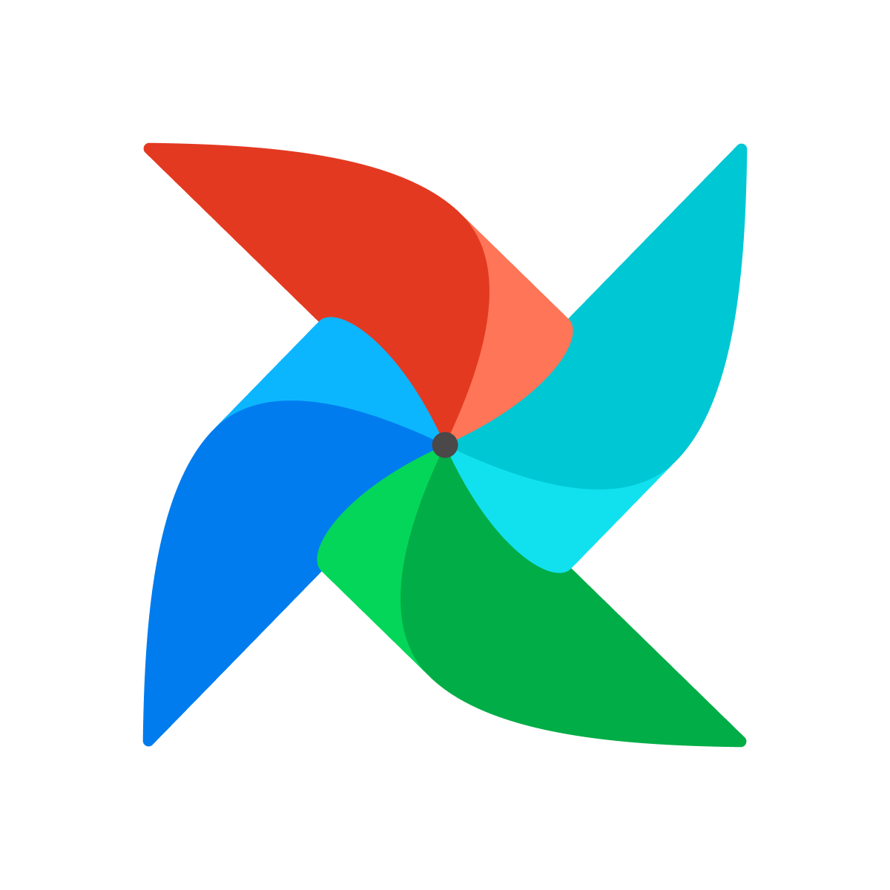

# Welcome to my Profile

 

## I am a Software/Data Engineer with DevOps skills

---

  
<b>about me</b>

* 10+ years as a Software/DevOps engineer, and I keep on learning
* Expert in building backend, automation
* Built systems with C/C++, JavaScript, Java, Python
* Cloud experience with AWS, GCP, Azure
* Experienced in distributed computing (Kubernetes, Microservices)
* Experienced in OOP
* Experienced in Agile methodologies
* Comfortable with DevOps duties
* Can fulfill Software/Data Engineer roles
* BSc in Computer Science & Engineering (2013)

My interests are (I spend time thinking about):
* Fact based decisions
* Automating as much as possible

Some values/perspectives I have:
* I am not religious or obsessed with any platform/language/tool. They are all good when used in the right context. I care about problems and domains. 
* For me people and organization culture are more important than tech & tools. 

<!--img align="center" height="766" width="600" src="assets/youcandoit.jpeg" alt="You Can Do it" /-->

 

  
<b>skills/tools/platforms</b>

Over the years I used several programming languages, frameworks and tools. I only list the ones below that I recently use(d) 

**Programming Languages**:

&nbsp;
&nbsp;

&nbsp;
&nbsp;
&nbsp;

&nbsp;

 

**Big Data**:

&nbsp;
&nbsp;

&nbsp;
&nbsp;

&nbsp;
&nbsp;

&nbsp;
&nbsp;

&nbsp;
&nbsp;

**Sql/NoSql**:

&nbsp;
&nbsp;

&nbsp;
&nbsp;

&nbsp;
&nbsp;

&nbsp;
&nbsp;

&nbsp;
&nbsp;

**Platforms/Ops**:

&nbsp;
&nbsp;

&nbsp;
&nbsp;

&nbsp;
&nbsp;

&nbsp;
&nbsp;

&nbsp;
&nbsp;

&nbsp;

&nbsp;
&nbsp;
 

**Frameworks**

&nbsp;
&nbsp;

**Daily**:

&nbsp;
&nbsp;

&nbsp;
&nbsp;

&nbsp;
&nbsp;

&nbsp;
&nbsp;

&nbsp;
&nbsp;

&nbsp;
&nbsp;

 

  
<b>what's here</b>

* [my projects](https://github.com/balazsmaszlag)
* [learnings](https://github.com/balazsmaszlag?tab=repositories&q=&type=fork&language=&sort=): code & notes for followed courses and learning materials

 

  
<b>how to reach me</b>

 

 

  
<b>before you leave</b>

 

> It always seems impossible until it’s done. You can do it.

